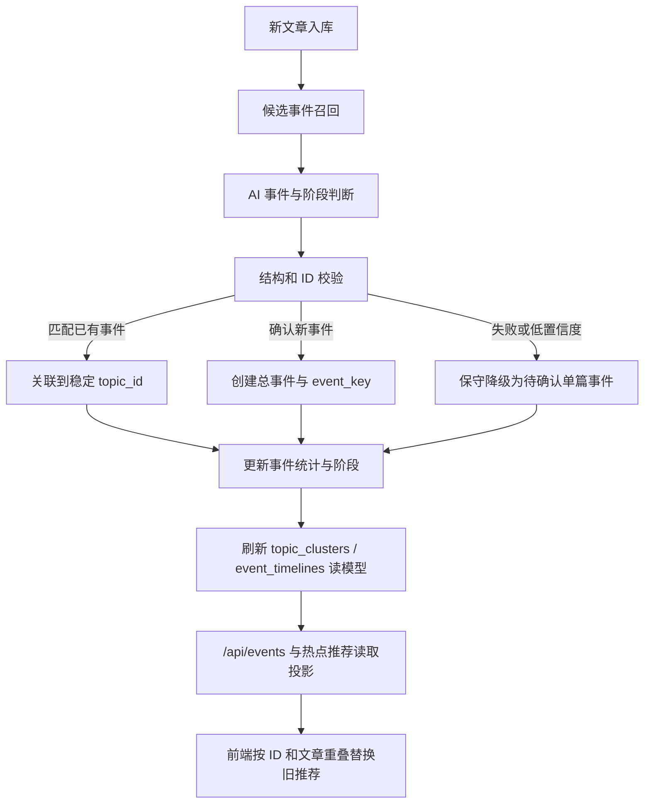

# 新闻总事件智能聚合开发设计

> 状态：第二版，待用户复审。本文只定义设计与验收边界，不授权修改业务代码、数据库、配置或前端。

## 1. 背景与问题

当前系统已经具备三种不同能力，但它们解决的问题不同：

1. 入库去重按规范化 URL 和完整正文 `content_hash` 识别完全重复文章。
2. `TopicExtractionService` 逐篇调用模型，把文章归入 `news_topics`。
3. `TrendingTopicService` 在近期标题窗口中生成热点推荐，前端会短期保留不同批次的推荐。

真实运行数据表明，同一事件仍会被拆分。例如“武大靖出任中国短道速滑队主教练”的六篇报道被分配到三个主题，其中一个主题还因来源板块绑定错误落入 `politics`。A 股行情也存在多个近义主题，并且模型每次改写热点标题时会生成不同热点 ID。前端目前只按精确 ID 或精确标题去重，因此会把这些近义结果同时保留。

本项目需要保留每篇原始报道，但在产品层将语义相同的报道合并为一个“总事件”，并把开盘、午评、收评、拟任、官宣、后续分析等差异保存为总事件内部的阶段。

## 2. 目标

### 2.1 必须实现

- 同一具体事件的不同标题、不同门户报道只展示为一个总事件。
- 同一总事件中的发展阶段分别保存和展示，不能把相反或先后变化的事实压成一条事实。
- AI 在后台分别判断“新文章属于哪个候选总事件”“事件处于哪个阶段”和“文章属于什么报道类型”。
- 程序控制候选范围、校验真实 ID、处理幂等写入并保留审计证据。
- 来源板块误分类不能阻断同一事件合并；原始文章分类仍保留，不被聚类过程改写。
- AI 不可用、超时或返回非法结果时安全降级，不进行不可靠合并，也不让前端继续积累近义热点。
- 修复当前历史重复主题，并提供执行前预览、可重复运行和可追溯结果。

### 2.2 不在本次范围

- 不删除或合并原始新闻文章。
- 不引入向量数据库、外部 embedding 服务或新的模型供应商。
- 不重新设计现有新闻抓取、搜索或整个专题工作台。
- 不让 AI 自由查询数据库、自由创建任意关联或直接执行 SQL。
- 不对所有旧主题进行人工语义重写；只处理有明确合并证据的重复主题。

## 3. 概念定义

### 3.1 文章 Article

门户中的一篇原始报道。不同 URL、不同正文的报道分别保存，即使它们描述同一事件。

### 3.2 总事件 Canonical Event

多篇报道共同指向的稳定事件容器，沿用现有 `news_topics` 作为权威存储。总事件具有稳定 `topic_id`，展示名称改变时 ID 不变。

示例：

```text
topic_id: ntp_xxx
canonical_name: 武大靖出任中国短道速滑队主教练
primary_category: sports
```

### 3.3 事件阶段 Event Stage

事件阶段表达“事件发展到哪一步”，与媒体采用什么文章体裁无关。阶段保存在文章与总事件的关联上；同一阶段可以有多篇不同类型的文章。

首版使用以下有限枚举：

| 阶段 | 含义 | 示例 |
| --- | --- | --- |
| `initial` | 事件首次发生或首次公开 | 首次披露、事故发生 |
| `proposed` | 尚未最终确认 | 拟出任、拟发布 |
| `announced` | 正式公告或确认 | 官宣出任、正式发布 |
| `opening` | 日内开盘阶段 | A 股开盘低开 |
| `midday` | 日内午间阶段 | A 股午评冲高 |
| `closing` | 日内收盘阶段 | A 股收评上涨 |
| `follow_up` | 已确认事件出现后续事实 | 新回应、新措施 |
| `resolved` | 事件明确结束或形成最终结果 | 调查结论、比赛结束 |
| `unknown` | 无法可靠判断 | 信息不足 |

阶段只组织事实进展，不决定文章是否完全重复，也不使用 `analysis`、`opinion` 等文章体裁名称。

### 3.4 文章类型 Article Type

文章类型表达“这篇内容怎样报道事件”，与事件阶段正交。首版枚举为：

| 类型 | 含义 | 是否可单独推动总事件摘要 |
| --- | --- | --- |
| `fact_report` | 对已发生事实的直接报道 | 可以 |
| `live_update` | 对同一事件的实时更新 | 可以 |
| `official_statement` | 官方公告或当事方正式回应 | 可以，优先级较高 |
| `analysis` | 对已有事实的分析和预测 | 不可以，除非同时含有可核验新增事实 |
| `opinion` | 评论或观点 | 不可以 |
| `explainer` | 背景解释 | 不可以 |
| `recap` | 对已有信息的回顾 | 不可以 |
| `rumor` | 未证实传闻 | 不可以，并降低合并置信度 |
| `unknown` | 无法可靠判断 | 不可以 |

例如“武大靖能否带队走出低谷”可以是 `event_stage=announced`、`article_type=analysis`。它属于任命总事件，但不能因评论内容改写总事件的事实摘要。

### 3.5 事件指纹 Event Fingerprint

事件指纹是可持久化、可版本化的稳定识别协议，不直接使用模型每次生成的展示标题。指纹算法版本使用显式字符串，例如 `event-fingerprint/v1`。V1 的规范化载荷为：

```json
{
  "subject_key": "武大靖",
  "action_key": "出任",
  "object_key": "中国短道速滑队主教练",
  "temporal_scope": null
}
```

- `subject_key`：核心主体的规范化表达。
- `action_key`：事件动作的规范化表达。
- `object_key`：动作对象的规范化表达。
- `temporal_scope`：事件时间边界；普通任命事件可为空，日行情必须包含交易日期。

程序以固定 JSON 序列化规则计算：

```text
fingerprint_hash = sha256(algorithm_version + "\n" + canonical_json(payload))
event_key = "confirmed:" + algorithm_version + ":" + fingerprint_hash
```

`canonical_json` 在 V1 中固定为：所有字符串先做 Unicode NFC 规范化；对象键按字典序排列；UTF-8 编码；不转义中文；分隔符固定为 `,` 和 `:`；保留 JSON `null`；禁止浮点数和未声明字段。任何规则变化都必须升级算法版本。

规范化载荷、算法版本、hash 和生成时间必须持久化，不能只把 hash 写在 `news_topics`。算法升级时保留旧版本记录并新增版本；不得就地重算并覆盖历史指纹。一个总事件可以同时保留多个算法版本的指纹，但同一算法版本和 hash 只能归属于一个未归档总事件。

### 3.6 Pending 事件身份

AI 不可用、低置信度或候选冲突时，系统创建可重试的 pending 事件。pending 不使用语义指纹，避免低质量字段抢占正式指纹。新文章使用：

```text
algorithm_version = "pending-article/v1"
event_key = "pending:article/v1:" + sha256(article_id)
```

无法可靠回填指纹的旧多文章主题使用：

```text
algorithm_version = "pending-legacy-topic/v1"
event_key = "pending:legacy-topic/v1:" + sha256(legacy_topic_id)
```

两类 pending key 都只标识“尚未确认”，不能用于跨文章或跨主题自动合并。后续确认后，文章关系迁移到 confirmed 总事件，pending 主题标记为 `status=merged` 并指向最终 `topic_id`；pending key 永不升级或改写为 confirmed key，只把原指纹记录标记为 `superseded`。`resolved` 只用于事件阶段，不能作为主题生命周期状态。

## 4. 方案比较

### 4.1 方案 A：纯标题相似度

对清洗后的标题计算字符或关键词相似度，超过阈值便合并。

优点是实现快、无需模型；缺点是无法可靠区分“A 股低开”和“A 股收涨”，也无法理解“执教”和“出任主教练”的语义等价。误合并风险高，不采用。

### 4.2 方案 B：纯 AI 自由聚类

每次把所有近期新闻交给 AI，让 AI 自由输出主题名称和文章分组。

优点是语义能力强；缺点是标题和分组会随批次漂移，模型可能引用非法 ID，故障后缺少稳定回退，不适合作为数据库权威层。不采用。

### 4.3 方案 C：AI 语义判断 + 程序协议约束

程序先根据时间、主体、关键词和已有关联召回少量候选总事件；AI 只能从候选中选择已有 `topic_id`，或明确返回“创建新事件”。程序校验后写入稳定指纹、阶段和关联。热点推荐继续使用这些权威总事件，前端再以事件 ID 和文章重叠做防御性去重。

这是推荐方案。它遵循仓库现有的 `SOFT -> HARD -> SOFT` 原则：AI 负责语义，程序负责稳定协议，前端负责表达。

## 5. 权威模型与总体架构



### 5.1 唯一事实源

- `news_articles`：原始文章事实源。
- `news_topics`：总事件事实源，保存稳定 `topic_id`、当前名称、当前摘要和生命周期。
- `news_topic_articles`：文章归属事实源，保存事件阶段、文章类型和本次有效分类结果。
- `news_event_fingerprints`：事件身份协议事实源，保存所有版本的 confirmed 或 pending 指纹。
- `news_event_classification_audits`：逐文章、逐尝试的不可变审计事实源。

AI 输出只是分类建议。只有通过程序校验并在事务中写入上述事实表后，才成为系统事实。

### 5.2 现有事件表和接口的统一关系

当前 `/api/events` 会同步调用 `EventDiscoveryService.discover()`，按关键词重新分桶并写入 `topic_clusters`；该链路与 `news_topics` 并行。`event_timelines` 当前只有表结构，尚未进入实际读写主线。修订后的关系固定为：

| 对象 | 新职责 | 是否权威 | 写入方式 |
| --- | --- | --- | --- |
| `news_topics` | 总事件及其当前状态 | 是 | 分类/合并事务 |
| `news_topic_articles` | 文章归属、事件阶段、文章类型 | 是 | 分类/合并事务 |
| `news_event_fingerprints` | 带版本的稳定事件身份 | 是 | 分类/合并事务 |
| `topic_clusters` | 热度、来源数、文章数等可重建聚合投影 | 否 | 后台投影刷新器 |
| `event_timelines` | 从文章关系生成的阶段时间线投影 | 否 | 后台投影刷新器 |
| `GET /api/events` | 读取总事件聚合结果 | 否 | 只读，不触发发现或写库 |

`topic_clusters.id` 直接使用权威 `news_topics.id`，不再额外维护第二个事件 ID；表中只需增加 `projection_version`、`projected_at`，历史随机 cluster ID 仅用于迁移识别，不再生成。`event_timelines` 增加明确的 `topic_id` 和 `article_id`，其每一项可以从权威关系重建；旧 `cluster_id` 仅作迁移兼容，完成回填后与 `topic_id` 保持相同值。

`EventDiscoveryService` 改为只负责刷新读模型，不再自行决定文章归属。`GET /api/events` 只调用存储层读取有效投影；投影缺失或落后时可直接从 `news_topics` 与关联表只读计算响应，但不得在 GET 请求内写库。

### 5.3 投影一致性

每次权威事件事务成功后，将对应 `news_topics.projection_state` 标为 `dirty`。事务提交后由同进程轻量刷新或后台循环重建两个投影；成功后写入 `projection_version` 和 `projected_at`。投影刷新失败不回滚已经确认的文章归属，API 可以回退到权威表只读聚合。

`topic_clusters` 和 `event_timelines` 可以清空后完全重建，因此不承载人工编辑、稳定身份、摘要版本或合并审计。

## 6. 数据模型设计

首版扩展现有权威表，并增加事件指纹、摘要修订、逐文章分类审计三个专用事实表；现有聚类和时间线表降级为可重建投影，不形成平行权威。

### 6.1 `news_topics` 新增字段

| 字段 | 类型 | 规则 |
| --- | --- | --- |
| `canonical_name` | TEXT，可空 | 当前标准展示名称；旧 `name` 保持兼容并逐步同步 |
| `primary_category` | TEXT，可空 | 由有效关联文章的多数分类决定；同票时保留已有值，仍无值时按来源优先级最高的事实型文章决定 |
| `category_scope_json` | TEXT，默认 `[]` | 事件实际覆盖的原始文章分类 |
| `event_date` | TEXT，可空 | 日行情等强时间边界事件使用 `YYYY-MM-DD` |
| `identity_status` | TEXT，默认 `confirmed` | `confirmed` 或 `pending`；旧数据升级时无法确认则为 `pending`，主题生命周期继续由原 `status` 管理 |
| `merged_into_topic_id` | TEXT，可空 | 历史重复主题归档后指向主主题 |
| `active_fingerprint_id` | TEXT，可空 | 指向当前采用的版本化指纹记录 |
| `summary_revision` | INTEGER，默认 `0` | 当前摘要修订号 |
| `projection_state` | TEXT，默认 `dirty` | `dirty` 或 `ready` |

兼容原则：已有代码仍可读取 `name` 和 `category`。迁移期间 `canonical_name` 缺失时回退到 `name`，`primary_category` 缺失时回退到 `category`。

### 6.2 `news_topic_articles` 新增字段

| 字段 | 类型 | 规则 |
| --- | --- | --- |
| `event_stage` | TEXT，默认 `unknown` | 使用第 3.3 节枚举 |
| `stage_label` | TEXT，可空 | AI 给出的简短阶段说明，例如“正式官宣” |
| `article_type` | TEXT，默认 `unknown` | 使用第 3.4 节枚举，与事件阶段独立 |
| `classification_reason` | TEXT，可空 | 一句话说明合并依据，供审计和排错 |
| `classification_source` | TEXT，默认 `legacy` | `llm`、`rule`、`fallback` 或 `legacy` |
| `classified_at` | TEXT，可空 | 最近一次分类时间 |

继续保持一篇文章只能关联一个总事件的现有约束。若未来出现“一文多事件”的真实需求，应单独设计，不能在本次顺带放开。

### 6.3 新表 `news_event_fingerprints`

| 字段 | 规则 |
| --- | --- |
| `id` | 主键，例如 `efp_xxx` |
| `topic_id` | 归属的权威总事件 |
| `key_kind` | `confirmed` 或 `pending` |
| `algorithm_version` | `event-fingerprint/v1`、`pending-article/v1` 或 `pending-legacy-topic/v1` |
| `normalized_payload_json` | confirmed 保存规范化语义载荷；pending 保存文章 ID 或旧主题 ID |
| `fingerprint_hash` | confirmed 使用规范化载荷 SHA-256；pending 使用对应文章 ID 或旧主题 ID 的 SHA-256 |
| `event_key` | 完整、可对外返回的带命名空间 key |
| `status` | `active` 或 `superseded` |
| `created_at` / `superseded_at` | 版本生命周期 |

索引与约束：

- `event_key` 全表唯一。
- 对 active confirmed 记录建立 `(algorithm_version, fingerprint_hash)` 条件唯一索引。
- 同一 `topic_id + algorithm_version` 最多一条 active confirmed 指纹。
- pending key 不参与 confirmed 指纹唯一约束，也不允许作为跨文章或跨主题合并依据。

### 6.4 新表 `news_topic_summary_revisions`

总事件摘要必须可追溯，不能只覆盖 `news_topics.summary`：

| 字段 | 规则 |
| --- | --- |
| `id` | 修订记录主键 |
| `topic_id` / `revision` | 同一事件内单调递增并唯一 |
| `summary` | 本版总事件事实摘要 |
| `source_article_ids_json` | 支撑本版摘要的真实文章 ID |
| `stage_snapshot_json` | 本版摘要引用事实所覆盖的阶段集合；不假设所有事件阶段都能线性比较 |
| `generation_source` | `llm`、`rule` 或 `migration` |
| `reason_code` | `created`、`stage_advanced`、`fact_added`、`correction` 或 `topics_merged` |
| `created_at` | 修订时间 |

`news_topics.summary` 只是当前修订的读取缓存；权威历史在修订表中。

同一总事件的新修订号在 `BEGIN IMMEDIATE` 事务内读取当前 `summary_revision` 后加一，并以 `(topic_id, revision)` 唯一约束防止遗漏或重复。写入修订记录和更新 `news_topics.summary/summary_revision` 必须在同一事务完成。

### 6.5 新表 `news_event_classification_audits`

每篇文章的每一次分类、重试、合并或拒绝都追加一条审计记录，不覆盖旧记录：

| 字段 | 规则 |
| --- | --- |
| `id` / `attempt_id` | 审计主键和一次尝试的关联 ID |
| `article_id` | 被处理文章 |
| `candidate_topic_ids_json` | 当时程序提供的候选集合 |
| `from_topic_id` / `to_topic_id` | 重分类或合并前后归属 |
| `decision` | `created`、`merged`、`pending`、`rejected`、`idempotent`、`reclassified`、`conflict_reused` 或 `failed` |
| `event_key` / `algorithm_version` | 本次决策采用的指纹 |
| `event_stage` / `article_type` | 两个独立分类维度 |
| `confidence` / `classification_source` | 置信度与来源 |
| `reason_code` / `reason_text` | 稳定原因码与简短说明 |
| `model_key` / `schema_version` | 可选的模型逻辑名与分类协议版本，不保存密钥 |
| `created_at` | 尝试时间 |

即使 AI 超时、返回非法 ID 或 SQLite 发生并发复用，也必须写入对应结果；若主事务失败，失败审计在回滚后通过独立短事务追加。

### 6.6 投影表约束

- `topic_clusters.id` 直接等于 `news_topics.id`，增加 `projection_version`、`projected_at`，每个 active 总事件只保留一条当前投影。
- `event_timelines` 增加 `topic_id`、`article_id`、`event_stage`、`article_type`、`projection_version`、`projected_at`。
- 两张表的行均可由权威表重新计算，禁止反向修改 `news_topics` 或文章归属。

### 6.7 API 输出新增字段

推荐主题 item 增加：

```json
{
  "id": "ntp_xxx",
  "event_key": "confirmed:event-fingerprint/v1:sha256...",
  "fingerprint_version": "event-fingerprint/v1",
  "title": "武大靖出任中国短道速滑队主教练",
  "category": "sports",
  "category_scope": ["sports", "politics"],
  "article_ids": ["art_1", "art_2"],
  "stages": [
    {"stage": "proposed", "label": "拟出任", "article_count": 1},
    {"stage": "announced", "label": "正式官宣", "article_count": 3}
  ],
  "article_types": [
    {"type": "fact_report", "article_count": 4},
    {"type": "analysis", "article_count": 2}
  ],
  "summary_revision": 3
}
```

现有字段全部保留，前端可渐进使用新增字段。

## 7. AI 后台分类协议

### 7.1 输入

每次只处理一篇新文章，并提供有限候选：

```json
{
  "article": {
    "article_id": "art_xxx",
    "bound_category": "politics",
    "title": "武大靖出任中国短道速滑队主教练",
    "content": "正文节选",
    "published_at": "2026-08-12T06:19:28+00:00"
  },
  "candidate_events": [
    {
      "topic_id": "ntp_xxx",
      "canonical_name": "武大靖出任中国短道速滑队主教练",
      "active_fingerprint": {
        "algorithm_version": "event-fingerprint/v1",
        "normalized_payload": {
          "subject_key": "武大靖",
          "action_key": "出任",
          "object_key": "中国短道速滑队主教练",
          "temporal_scope": null
        },
        "event_key": "confirmed:event-fingerprint/v1:sha256..."
      },
      "current_summary": {
        "revision": 2,
        "summary": "武大靖已正式出任中国短道速滑队主教练。",
        "source_article_ids": ["art_1", "art_2"]
      },
      "recent_items": [
        {
          "event_stage": "announced",
          "article_type": "official_statement",
          "stage_label": "正式官宣"
        }
      ],
      "category_scope": ["sports"],
      "identity_status": "confirmed"
    }
  ]
}
```

候选不再只限于文章的原始 `category`。程序先取同板块候选，再补充主体或关键词高度相关的跨板块候选，避免错误板块造成事件分裂。候选数量限制在 20 个以内。

### 7.2 结构化输出

AI 输出保持最小充分：

```json
{
  "existing_topic_id": "ntp_xxx",
  "canonical_name": "武大靖出任中国短道速滑队主教练",
  "subject": "武大靖",
  "action": "出任",
  "object": "中国短道速滑队主教练",
  "temporal_scope": null,
  "event_stage": "announced",
  "stage_label": "正式官宣",
  "article_type": "official_statement",
  "event_summary": "武大靖正式出任中国短道速滑队主教练。",
  "keywords": ["武大靖", "短道速滑", "主教练"],
  "classification_reason": "主体、职务和任命事件均与候选事件一致。",
  "confidence": 0.96
}
```

AI 不输出数据库 SQL、统计值、来源数或最终 `event_key` hash。程序根据结构化字段规范化并按指定算法版本计算 hash。请求和审计同时记录 `classification-schema/v1`，以便未来兼容输出协议升级。

### 7.3 程序校验

必须拒绝并降级的情况：

- `existing_topic_id` 不在候选列表中。
- `event_stage` 不在允许枚举中。
- `article_type` 不在允许枚举中。
- 关键字段为空，无法创建新事件。
- `temporal_scope` 与文章时间存在明显冲突。
- 置信度低于 `0.72`，且没有可复用的文章重叠证据。
- 模型试图更改文章 ID、原始标题、发布时间或来源分类。

允许但记录的情况：

- AI 认为跨板块候选是同一事件。
- AI 更新 `canonical_name`，但稳定 `topic_id` 和 `event_key` 不变。
- AI 对阶段返回 `unknown`，文章仍可在高置信事件匹配下归入总事件。

### 7.4 总事件名称与摘要更新规则

`event_summary` 是这篇文章带来的新增事实，不等同于总事件摘要。AI 不得直接覆盖 `news_topics.summary`。程序在文章归属事务完成后，根据文章类型、事件阶段、证据来源和现有摘要决定是否生成新摘要修订。

允许创建新摘要修订的条件：

1. 新建 confirmed 总事件，生成 revision 1。
2. 事件出现明确的事实推进，例如 `proposed -> announced`、`opening -> midday -> closing` 或任何阶段进入 `resolved`；这里使用显式领域转换规则，不对整个阶段枚举做通用大小排序。
3. `fact_report`、`live_update` 或 `official_statement` 带来现有摘要未包含的可核验新增事实。
4. 新文章明确纠正旧事实，使用 `reason_code=correction`，摘要必须表述“此前信息已被更正”，不得静默抹去历史。
5. 两个 confirmed 总事件合并，基于合并后的全部有效事实生成 `reason_code=topics_merged` 修订。

不得创建新摘要修订的情况：

- 只是新增门户转载，事实没有变化。
- `analysis`、`opinion`、`explainer`、`recap`、`rumor` 或 `unknown` 没有带来可核验新增事实。
- 只有模型措辞变化，没有事实变化。
- 低置信度或 pending 分类。

摘要生成使用当前有效摘要、候选新增事实以及真实 `source_article_ids`，输出一至三句话，只陈述至少一篇事实型文章直接支持的内容。若多个事实相互冲突，优先级依次为官方声明、多个独立来源一致报道、单一来源报道；无法消解时保留“各方信息存在差异”，不能自行选边。

具体更新流程固定为：先将本篇 `event_summary` 作为候选事实；程序检查文章类型、置信度、阶段转换和支撑文章 ID；再将候选事实与当前修订一起交给受约束的摘要生成步骤。生成步骤只能返回 `unchanged` 或包含完整新摘要的 `revise`。`unchanged` 不写修订；`revise` 必须附带 `reason_code` 和非空证据文章集合，通过校验后才在事务内增加 revision。AI 不可用时，新建事件使用文章的保守事实摘要；已有事件只有显式阶段推进或更正时才使用确定性模板更新，否则保持原摘要。

总事件名称更新比摘要更保守：只有从 `proposed` 进入 `announced/resolved`、旧名称明显含临时措辞，或历史主题合并时才更新 `canonical_name`。名称更新不改变 `topic_id`、active fingerprint 或旧摘要修订。

## 8. 候选召回与合并规则

候选召回按以下顺序组合并去重：

1. 最近 5 天同板块活跃事件。
2. 最近 5 天包含同一明确主体的跨板块事件。
3. 指纹关键部分匹配的事件。
4. 与文章标题关键词有显著交集的事件。

系统先应用确定性证据，再请求 AI：

- 文章已关联总事件：直接幂等返回。
- 新旧推荐的 `article_ids` 有重叠：视为同一总事件的不同表示。
- `event_key` 完全相同：直接复用总事件。
- 只有主体相同：必须交给 AI，不能直接合并。
- 动作结果相反但处于同一日行情：合并为同一总事件、保存不同阶段。
- 动作结果相反且不是阶段演变：不能合并。

### 8.1 A 股示例

以下内容归入总事件 `2026-08-12 A股市场行情`：

| 新闻 | 阶段 |
| --- | --- |
| A 股开盘：三大指数集体低开 | `opening` |
| A 股午评：三大指数冲高 | `midday` |
| A 股收评：三大指数集体收涨 | `closing` |

`temporal_scope` 必须是交易日期 `2026-08-12`。不同交易日默认创建不同总事件，防止把长期每天行情无限合并。

### 8.2 武大靖示例

以下内容归入总事件 `武大靖出任中国短道速滑队主教练`：

| 新闻 | 阶段 |
| --- | --- |
| 武大靖拟出任国家短道速滑队主教练 | `proposed` |
| 官宣武大靖出任主教练 | `announced` |
| 武大靖能否带队走出低谷 | `announced` |

第三篇文章的 `article_type=analysis`，前两篇分别可以是 `fact_report` 和 `official_statement`。“武大靖谈退役后的个人生活”不能仅因主体相同而进入该事件。

## 9. 热点推荐改造

### 9.1 后端

`TrendingTopicService` 优先从已确认的总事件产生推荐：

- 推荐 ID 使用稳定 `topic_id`，不再根据模型生成标题重新计算。
- 汇总同一总事件下所有有效文章、来源和阶段。
- `canonical_name` 作为展示标题。
- 只有尚未完成单篇分类时，才使用标题窗口 AI 聚类作为临时候选。
- 临时候选若与已有总事件文章重叠，应映射回已有 `topic_id`。
- `pending` 单篇事件只能以“新线索”出现，不能计算为多源热点。
- `/api/events` 与 `/api/topics/recommended` 使用相同的权威 `topic_id`，前者提供全局事件投影，后者只在相同事件集合上增加时间窗、热度和个性化排序。

标题窗口 AI 仍可用于发现热点，但不再成为事件身份的权威来源。

### 9.2 前端

前端保留短期稳定展示能力，但改变推荐替换规则：

1. ID 相同：新结果替换旧结果。
2. `event_key` 相同：新结果替换旧结果。
3. `article_ids` 存在交集：新结果替换旧结果。
4. 仅标题相似：不在前端自行猜测合并，交给后端。

这样能消除模型改写标题造成的缓存累积，同时避免浏览器承担新闻语义判断。

总事件卡片继续只占一行；详情和事件线展示阶段。首版不改变页面整体布局。

## 10. 降级与错误处理

### 10.1 AI 未配置

- 只使用已有文章关联或 active confirmed 指纹完全相同的情况做确定性归并。
- 不能确认时创建 `identity_status=pending` 的单篇事件及 `pending:article/v1:<sha256(article_id)>` key。
- 不用宽松标题相似度强行合并。

### 10.2 AI 超时、HTTP 错误或结构非法

- 记录错误类型、文章 ID、候选事件 ID 列表，但不记录密钥或完整敏感配置。
- 当前文章进入可重试状态；若产品必须立即展示，则显示为一个“新线索”。
- 后续成功分类时复用文章关联并替换前端旧线索，不能同时保留两份。

### 10.3 低置信度

- `confidence < 0.72` 时不自动并入已有事件，除非存在 `event_key` 完全相同或文章重叠等确定性证据。
- 保存为 `pending`，后续新证据到达时允许重新分类。

### 10.4 幂等与并发

- `news_topic_articles.article_id` 继续保证一篇文章只有一个归属。
- confirmed 指纹建立条件唯一约束前，迁移脚本先消除现有重复。
- 重跑同一篇文章不得增加 `article_count`。
- 所有成功决策必须在同一事务中写入文章关联和对应审计；失败决策在主事务回滚后用独立短事务记录。

### 10.5 SQLite 并发冲突处理

当前 `NewsStore` 使用 WAL、30 秒 `busy_timeout`，但普通连接是延迟事务。总事件创建和合并需要更明确的写锁与冲突复用流程：

1. AI 分类在事务外完成，避免持锁等待模型。
2. 进入短事务后执行 `BEGIN IMMEDIATE`，尽早取得 SQLite 写锁。
3. 再次查询 `news_topic_articles.article_id`；若其他 worker 已处理，返回 `idempotent` 并审计现有归属。
4. 对 confirmed 结果再次查询 active `(algorithm_version, fingerprint_hash)`。
5. 若事务外查询时不存在、但取得写锁后已存在，说明另一个 worker 先提交；复用其 `topic_id` 并审计为 `conflict_reused`。
6. 锁内仍不存在时才插入 `news_topics` 和 `news_event_fingerprints`。SQLite 的单写者模型意味着正常并发不会在这一步交错插入；若仍触发该指纹的唯一约束，先回滚并只读查询胜出记录，查询到才复用并审计为 `conflict_reused`，查询不到则作为数据一致性错误失败，不能猜测目标事件。
7. 关联文章、重算主题统计、写摘要修订、标记投影 dirty 和写成功审计在同一事务提交。

对 `database is locked/busy` 只进行最多 3 次有界重试，使用 50、150、350 毫秒退避；仍失败则不创建替代事件，写失败审计并留待后台重试。不得把锁冲突降级成新的 pending 主题，否则会再次制造重复。

新文章 pending key 基于唯一 `article_id` 的 hash，并发插入同样采用冲突后复用。事务 API 需要允许调用方区分 `idempotent`、`conflict_reused` 和真正失败。

pending 文章被确认时，在同一个 `BEGIN IMMEDIATE` 事务中更新 `news_topic_articles.topic_id`、重算原 pending 与目标 confirmed 主题统计、归档空的 pending 主题、把 pending 指纹标为 `superseded`、追加 `decision=reclassified` 审计并标记两个投影 dirty。不得先删除 pending 关系再另行插入，避免中途失败丢失归属。

## 11. 历史数据修复

新增只读预览脚本和显式执行模式：

```text
python scripts/repair_duplicate_news_topics.py --database personal_news.db --dry-run
python scripts/repair_duplicate_news_topics.py --database personal_news.db --apply
```

默认必须是 `--dry-run`，输出：

- 建议保留的主主题；
- 建议归档的重复主题；
- 将迁移的文章 ID；
- 归并依据与置信度；
- 跳过的低置信候选。

`--apply` 在单个事务中：

1. 把重复主题的文章关联迁移到主主题。
2. 重新计算文章数、来源分类范围和首末时间。
3. 将重复主题标记为 `status=merged` 并写入 `merged_into_topic_id`。
4. 不删除原主题和审计证据。
5. 为每一篇迁移文章追加 `decision=reclassified` 的合并审计，使用同一个 `attempt_id` 表示本批修复。
6. 写入批次级操作日志，汇总成功、跳过、冲突和失败数量。

脚本不得自动处理只有主体相同的主题。当前武大靖两个体育主题可以合并；政治板块主题需要通过跨板块事件证据合并。A 股旧主题只有在交易日期和阶段能够确认时才合并，不能把五天内所有“A 股行情”粗暴压成一个主题。

## 12. 组件与文件边界

计划阶段预计涉及以下文件；最终精确步骤将在本文获批后另写实施计划。

| 文件 | 责任 |
| --- | --- |
| `personal_news_agent/services/event_identity.py` | 新建；事件字段规范化、`event_key` 计算、阶段枚举与确定性比较 |
| `personal_news_agent/services/events.py` | 将关键词聚类器改为基于权威总事件刷新投影，不再决定文章归属 |
| `personal_news_agent/services/topic_extraction.py` | 扩展 AI 输入输出协议，召回跨板块候选，执行程序校验 |
| `personal_news_agent/prompts/topic_extraction.md` | 明确总事件、阶段判断和跨板块合并语义 |
| `personal_news_agent/services/store.py` | 数据迁移初始化、候选查询、事务内事件复用和统计重算 |
| `personal_news_agent/services/trending_topics.py` | 使用稳定 `topic_id/event_key` 物化推荐并按总事件汇总 |
| `personal_news_agent/api/routes.py` | 令 `GET /api/events` 成为无副作用的投影读取接口 |
| `personal_news_agent/static/web.js` | 按 ID、`event_key`、文章交集替换缓存推荐 |
| `personal_news_agent/static/mobile.js` | 与桌面端保持相同的推荐去重规则 |
| `scripts/repair_duplicate_news_topics.py` | 历史重复主题预览和显式修复 |
| `sql/upgrade_pna_news_event_aggregation_sqlite.sql` | SQLite 升级脚本 |
| `sql/upgrade_pna_news_event_aggregation_mysql.sql` | 不在首版创建；当前新闻总事件事实源是 SQLite，只有权威存储迁移到 MySQL 时才另行设计 |
| `tests/test_event_identity.py` | 事件指纹与阶段边界单元测试 |
| `tests/test_events.py` | `/api/events` 投影来源、无 GET 写入和重建一致性测试 |
| `tests/test_topic_extraction.py` | AI 候选约束、跨板块合并、降级和幂等测试 |
| `tests/test_trending_topics.py` | 稳定热点 ID、事件汇总和文章重叠测试 |
| `tests/test_subpath_frontend.py` | 前端缓存替换静态契约测试 |
| `tests/test_topic_repair.py` | 历史修复 dry-run、apply、逐文章审计、重跑与回滚测试 |

不修改 `news_articles` 的去重语义；它仍负责保留不同媒体的独立报道。

## 13. 测试策略

开发必须按测试驱动顺序进行，先写失败用例，再实现最小改动。

### 13.1 正向归并

- 三个不同来源、不同措辞的武大靖官宣报道得到同一 `topic_id`。
- “拟出任”“官宣”“执教前景”属于同一总事件；阶段分别为 `proposed`、`announced`、`announced`，第三篇的文章类型为 `analysis`。
- 来源分类为 `politics` 的武大靖报道能归入以 `sports` 为主分类的总事件，且原文章分类不变。
- 同一天 A 股开盘、午评、收评属于同一总事件，并保留三个阶段。
- `GET /api/events` 与热点推荐返回同一组稳定 `topic_id`，GET 请求不创建或更新任何事件。
- 清空 `topic_clusters` 与 `event_timelines` 后，可以从权威表重建相同投影。

### 13.2 防误合并

- 不同交易日的 A 股行情得到不同 `event_key`。
- 相同规范化载荷在 `event-fingerprint/v1` 下得到稳定相同 hash；升级到 V2 时保留 V1 记录。
- “武大靖出任主教练”和“武大靖谈退役生活”不能合并。
- 同一公司发布不同产品不能只因主体相同而合并。
- “指数低开”和“指数收涨”不能在阶段摘要中互相覆盖。
- AI 返回候选列表外的 `topic_id` 必须被拒绝。

### 13.3 降级

- AI 未配置时，active confirmed 指纹完全相同才可确定性复用；不确定文章进入带文章级 pending key 的 `pending`。
- 两篇 pending 文章或两个 legacy pending 主题即使标题相似，也不能因 pending key 自动合并。
- AI 超时或返回非法 JSON 时不污染已有事件。
- 低置信度分类不能自动合并。
- 同一篇文章重试不会重复增加文章计数。
- 两个 SQLite worker 同时创建相同 confirmed 指纹时只产生一个总事件，失败方返回 `conflict_reused`。
- 锁冲突重试耗尽时不创建替代 pending 事件，并留下逐文章失败审计。

### 13.4 摘要与分类维度

- `event_stage` 和 `article_type` 分别校验，`analysis` 不能作为阶段值。
- 纯转载、评论或背景解释不增加 `summary_revision`。
- 从拟任到正式官宣会创建新摘要修订，并保存支撑文章 ID。
- 事实更正保留旧修订，新修订明确说明更正。
- 每次 created、merged、pending、rejected、idempotent、reclassified、conflict_reused 或 failed 都有一条对应的逐文章审计。

### 13.5 热点与前端

- 模型改变 `canonical_name` 后热点 ID 仍保持不变。
- 新旧推荐 ID 不同但 `article_ids` 有交集时，前端只保留新结果。
- 一个总事件在桌面端和移动端均只显示一张卡片。
- 总事件卡片的来源数和报道数来自合并后的真实文章关系。

### 13.6 历史修复

- dry-run 不修改数据库。
- apply 迁移关联但不删除旧主题。
- 重复执行 apply 结果不变。
- 中途失败时事务回滚。

## 14. 验收标准

以下条件全部满足才算修复完成：

1. 当前六篇武大靖相关报道最终只产生一个可见总事件，并显示多个阶段。
2. 同一交易日的 A 股开盘、午评、收评只出现一个总事件，详情保留各阶段事实。
3. 不同交易日的 A 股行情保持为不同总事件。
4. 同一主体的无关事件不会被错误合并。
5. 跨板块误分类文章可以进入正确总事件，但原始文章分类不变。
6. 后端推荐连续刷新时，即使 AI 改写标题，前端也不会累积重复卡片。
7. AI 不可用时系统仍可返回保守结果，不强行合并、不阻塞抓取。
8. 历史修复可预览、可审计、可重复执行，不物理删除数据。
9. 相关单元、API 和前端契约测试全部通过。
10. 使用真实数据库副本验证修复脚本，不能直接在唯一生产数据库上首次试运行。
11. `/api/events`、`topic_clusters` 和 `event_timelines` 不再形成独立事件身份，全部可追溯到同一个 `news_topics.id`。
12. 指纹算法升级不覆盖旧版本；pending key 不参与跨文章语义合并。
13. 总事件摘要的每次事实变化都有修订记录和证据文章，非事实型文章不随意改写摘要。
14. SQLite 并发创建相同事件时由唯一约束和冲突复用保证只落一个 confirmed 总事件。
15. 每一篇文章的每一次分类或合并尝试均可由专用审计表追溯。

## 15. 可观测性

`news_event_classification_audits` 记录逐文章决策；现有 `operation_logs` 只记录批次和服务级汇总，不能替代逐文章审计。两者均只保存以下非敏感信息：

- `article_id`；
- 候选 `topic_id` 列表；
- 最终 `topic_id`；
- `event_stage`；
- `article_type`；
- `event_key` 与指纹算法版本；
- `classification_source`；
- 置信度；
- 合并、创建、待确认或拒绝原因；
- 模型失败的错误类型。

热点 API 继续返回顶层 `generation_source`，并为每个 item 返回分类来源。这样可以区分：

- 权威总事件聚合；
- AI 临时候选；
- 确定性降级；
- 单篇待确认线索。

## 16. 发布与回滚

按以下顺序发布：

1. 备份数据库，在副本执行升级和修复 dry-run。
2. 执行数据库升级，新增可空兼容字段、事实表和投影字段，但暂不修复历史数据。
3. 发布兼容读取的新逻辑；`/api/events` 先启用只读权威表回退，不依赖投影已经完整。
4. 为旧 `news_topics` 回填 `migration` 摘要修订和版本化指纹；无法确认的旧主题使用 `pending-legacy-topic/v1` 状态和 key，不伪造 confirmed 指纹。
5. 重建 `topic_clusters` 和 `event_timelines` 投影，验证它们全部指向有效 `news_topics.id`。
6. 运行新分类、并发、摘要和热点测试，观察逐文章审计与错误日志。
7. 在副本执行历史修复 apply 并核对武大靖、A 股样例。
8. 经人工确认后在目标数据库执行修复。
9. 发布前端缓存替换逻辑，并升级推荐缓存 key，避免继续读取旧快照。

回滚时：

- 旧代码忽略新增可空字段，仍可读取原 `name/category`。
- 已合并的旧主题没有被删除，可依据 `merged_into_topic_id` 和操作日志恢复文章关联。
- 指纹和摘要修订采用追加记录；回滚应用版本不删除其历史。
- 投影可以清空后由权威表重建，不参与业务回滚依据。
- 前端缓存异常时可升级或清除推荐缓存 key，不影响服务端数据。

## 17. 设计决策摘要

- 保留不同媒体文章，不把语义聚合混入入库去重。
- 复用并扩展 `news_topics`，不建立第二套权威事件系统。
- `topic_clusters`、`event_timelines` 和 `/api/events` 统一为 `news_topics` 的只读投影层。
- AI 负责事件与阶段语义，程序负责候选、ID、约束、事务和审计。
- 总事件 ID 独立于可变展示标题。
- 事件指纹持久化并带算法版本，pending 使用文章级隔离 key。
- 事件阶段与文章类型正交保存，摘要只由有证据的新事实推动并保留修订历史。
- SQLite 通过短 `BEGIN IMMEDIATE` 事务、唯一约束和冲突复用避免并发重复事件。
- 日行情使用交易日期作为强时间边界。
- 前端只做稳定身份和文章重叠去重，不承担模糊语义判断。
- 不确定时宁可显示一个待确认线索，也不错误合并两个事件。

## 18. 审批门槛

用户确认本文之前，不执行以下操作：

- 不修改任何业务代码或提示词；
- 不创建或执行数据库迁移；
- 不运行历史数据修复；
- 不清理浏览器缓存；
- 不提交、推送或创建 PR。

用户确认本文后，下一步只生成逐文件、逐函数、测试先行的实施计划；实施计划再次确认后才开始开发。
